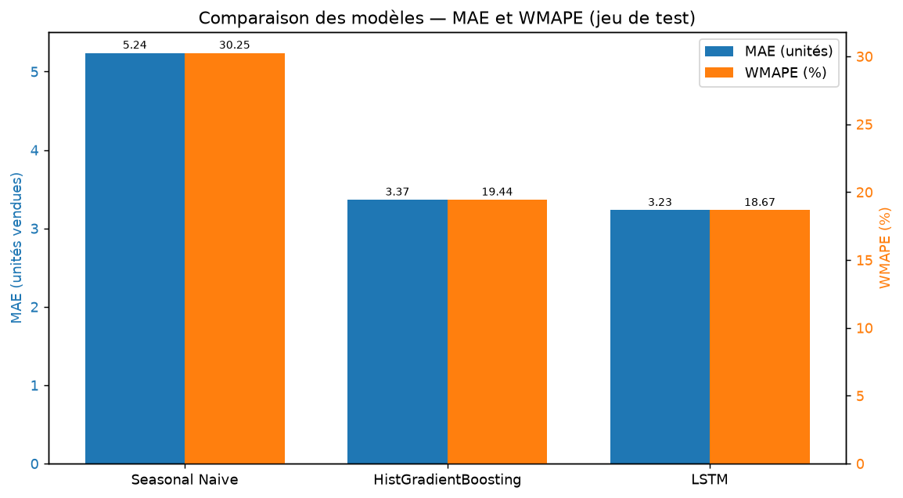
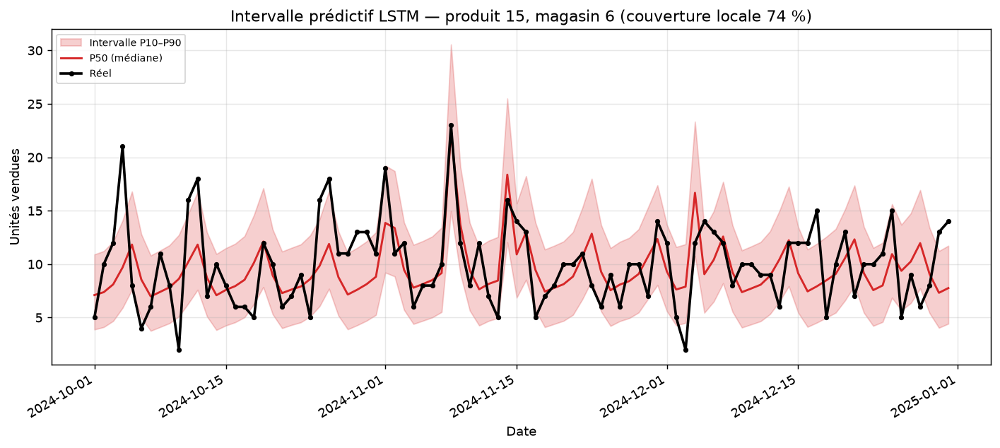
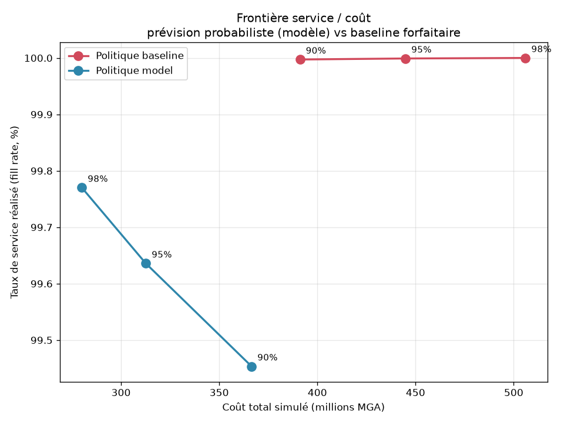
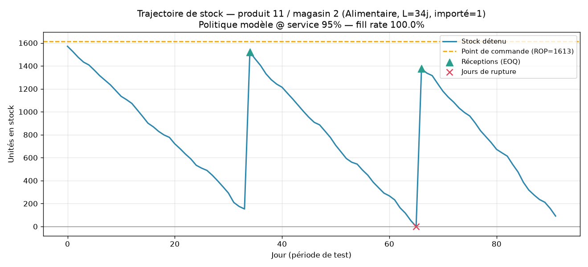
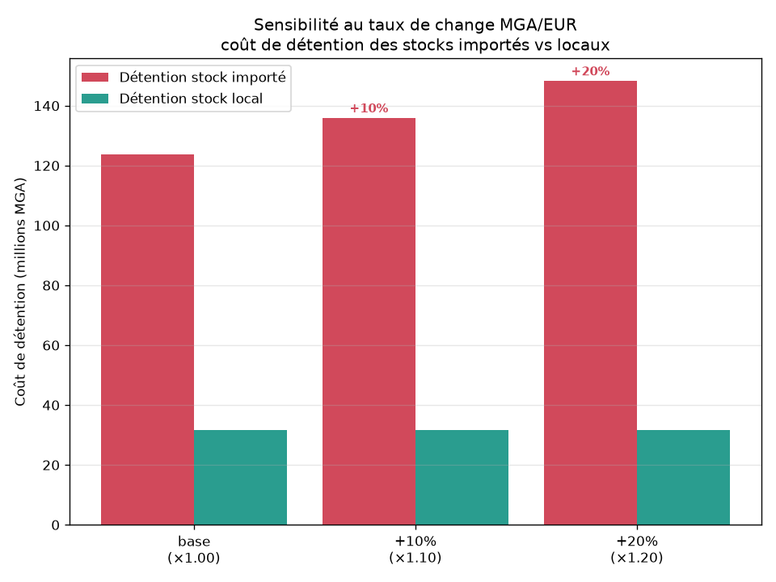

# 📦 StockSense — Prévision probabiliste de la demande & optimisation des stocks

> **Projet Data Science end-to-end.** De la donnée brute à la décision métier :
> une chaîne complète **SQL → feature engineering → modèles (scikit-learn + PyTorch) → optimisation des stocks**,
> appliquée à un distributeur/importateur en contexte **Madagascar** (sensibilité au taux de change Ariary/Euro).

`Python 3.13` · `SQLite` · `scikit-learn` · `PyTorch` · `pandas` · `matplotlib`

---

## 🎯 Contexte & objectif

Un importateur-distributeur malgache gère ~40 références (SKU) réparties sur 6 points de
distribution (Antananarivo, Tamatave, Majunga…). Deux difficultés structurelles :

1. **Demande volatile** — saisonnalité hebdomadaire et annuelle, promotions, jours fériés.
2. **Délais d'import longs et incertains** — les produits importés ont un délai de
   réapprovisionnement de 20 à 60 jours et un coût libellé en euros, donc **exposé au
   taux de change MGA/EUR**.

**Objectif :** prévoir la demande à 14 jours de façon *probabiliste* (pas seulement une
valeur moyenne, mais un intervalle de confiance) et convertir cette prévision en une
**politique de réapprovisionnement chiffrée** qui minimise le capital immobilisé tout en
maintenant un taux de service élevé.

> **Le vrai enjeu n'est pas la précision brute de la prévision, mais la qualité de la
> décision de stock qui en découle.** C'est le fil rouge du projet.

---

## 🗃️ Les données

Données **synthétiques mais réalistes** générées par `src/data_generation.py` (déterministe,
graine 42), organisées en **schéma en étoile** dans une base **SQLite** :

| Table | Lignes | Description |
|-------|--------|-------------|
| `fct_sales` | **263 040** | Ventes quotidiennes (units_sold, prix MGA, promo, CA) — 40 produits × 6 magasins × 1096 jours (2022-2024) |
| `dim_product` | 40 | SKU, catégorie, coût unitaire (EUR), importé/local, délai de livraison, pays fournisseur |
| `dim_store` | 6 | Magasins, région, ville, canal (retail / wholesale) |
| `dim_date` | 1 096 | Calendrier + **jours fériés malgaches** (indépendance 26 juin, Toussaint, Noël…) |
| `dim_fx` | 1 096 | Taux de change **MGA/EUR** (≈ 4 325 → 4 983 sur la période, tendance + saisonnalité + marche aléatoire) |

Le signal de demande combine : niveau par produit/magasin, **saisonnalité hebdo** (les
magasins retail vendent plus le week-end, le wholesale en semaine), **saisonnalité annuelle**
par catégorie, **tendance** (+20 %), **effet promo** (×1,5–2,5 et prix −20 %), **bump de jours
fériés**, **sensibilité négative au change** pour les produits importés, et un bruit de Poisson.

---

## 🏗️ Architecture du pipeline

```
data_generation.py ─▶ data/*.csv
        │
build_database.py + sql/schema.sql + sql/features.sql ─▶ stocksense.db (table ml_features)
        │
   dataset.py  (découpage temporel train/valid/test, sans fuite)
        │
   ┌────┴───────────────┐
 models_sklearn.py    model_pytorch.py   ─▶ reports/preds_*.parquet
 (baselines + HGB)    (LSTM probabiliste)
   └────┬───────────────┘
   evaluate.py ─────────────▶ metrics.json, comparison.csv, figures
   inventory_optimization.py ▶ simulation de politique de stock, sensibilité FX
        │
   run_pipeline.py  (orchestration bout-en-bout)
```

Reproduire l'intégralité du projet à partir de zéro :

```bash
python -m venv .venv && source .venv/bin/activate
pip install -r requirements.txt
python -m src.run_pipeline      # génère données, entraîne, évalue, optimise
```

---

## 🧪 Feature engineering (SQL)

Toutes les features sont calculées **en SQL** (`sql/features.sql`) via des *window functions*
SQLite, par série `(product_id, store_id)` ordonnée par date :

- **Retards** : `lag_1, lag_7, lag_14, lag_28` (`LAG(...) OVER (PARTITION BY … ORDER BY date)`)
- **Moyennes/écarts glissants** : `roll_mean_7, roll_mean_28, roll_std_7`, `roll_mean_7_lag7`
- **Calendaires** : `dow, month, weekofyear, is_weekend, is_holiday`
- **Exogènes** : `mga_per_eur` (change), `unit_cost_eur`, `is_imported`, `lead_time_days`, `promo_flag`, `days_since_promo`

> **Anti-fuite temporelle** rigoureux : les fenêtres utilisent `ROWS BETWEEN N PRECEDING AND
> 1 PRECEDING` (jamais le jour courant), le découpage train/valid/test est **strictement
> chronologique**, et le `StandardScaler` du LSTM n'est ajusté que sur le train. Vérifié
> par comparaison à un recalcul pandas décalé.

Découpage : **train** 2022-01 → 2024-06 · **validation** 2024-07 → 2024-09 · **test (hold-out)** 2024-10 → 2024-12.

---

## 🤖 Modèles & algorithmes

| Modèle | Type | Détail |
|--------|------|--------|
| **seasonal_naive** | Baseline | Prédiction = ventes du même jour la semaine précédente (`lag_7`) ; intervalle par quantiles empiriques des résidus |
| **HGB** | scikit-learn | `HistGradientBoostingRegressor` — P50 en `squared_error`, **P10/P90 en `loss="quantile"`** ; early stopping |
| **LSTM** | PyTorch | LSTM 2 couches (hidden 64) + tête à 3 quantiles, **perte pinball** ; monotonie P10≤P50≤P90 garantie par paramétrisation cumulative softplus |

Les trois produisent une **prévision probabiliste** (P10 / P50 / P90) — indispensable pour
dimensionner le stock de sécurité en aval.

### 📊 Résultats de prévision (test hold-out, 22 080 points)

| Modèle | MAE | RMSE | WMAPE | Pinball | Couverture P10–P90 (cible 80 %) |
|--------|-----|------|-------|---------|--------------------------------|
| **LSTM** 🏆 | **3.23** | 5.11 | **18.7 %** | **1.03** | **80.6 %** |
| HGB | 3.37 | **4.80** | 19.4 % | 1.07 | 78.8 % |
| seasonal_naive | 5.24 | 9.05 | 30.3 % | 1.84 | 80.4 % |

Le **LSTM** offre la meilleure erreur absolue (MAE **−38 %** vs baseline) et surtout un
**intervalle prédictif remarquablement calibré** (80,6 % de couverture réelle pour une cible
de 80 %), ce qui en fait le candidat idéal pour piloter le stock de sécurité.




---

## 💡 Innovation : de la prévision à la décision de stock

`src/inventory_optimization.py` transforme la prévision probabiliste en une **politique de
réapprovisionnement (point de commande, R,Q)** et la simule jour par jour sur la période test.

- **Stock de sécurité piloté par le modèle** : `SS = z · σ_jour · √L`, où **σ_jour est déduit
  de l'intervalle prédictif** du LSTM — `σ_jour = (P90 − P50) / 1,2816`. Le modèle « sait »
  quels articles sont incertains et concentre le stock de sécurité là où il compte.
- **Point de commande** : `ROP = demande moyenne prévue sur le délai L + SS`.
- **Quantité de commande** : **EOQ** (formule de Wilson) avec coût de détention dérivé du
  `unit_cost_eur` converti en MGA au taux courant.
- **Baseline « pratique courante »** : stock de sécurité forfaitaire proportionnel à `L`
  (au lieu de `√L`) sur une prévision naïve — l'erreur classique qui surdimensionne les
  articles à long délai (donc les imports).

### 📈 Résultats métier (simulation sur 92 jours, 240 séries)

| Niveau de service cible | Fill rate baseline | Fill rate modèle | **Réduction du coût total** | **Réduction valeur de stock** |
|-------------------------|--------------------|------------------|-----------------------------|-------------------------------|
| 90 % | 100,0 % | 99,5 % | **−6,3 %** | **−52,8 %** |
| 95 % | 100,0 % | 99,6 % | **−29,7 %** | **−57,8 %** |
| 98 % | 100,0 % | 99,8 % | **−44,6 %** | **−61,7 %** |

À service quasi équivalent (> 99,5 %), la politique pilotée par la prévision probabiliste
**divise par ~2 le capital immobilisé** (≈ 2,3 Md MGA contre 5–6,8 Md) et réduit le coût total
de 6 à 45 %. **Plus la cible de service est haute, plus le gain est important** — la règle
forfaitaire gaspille de plus en plus de capital.




### 💱 Sensibilité au taux de change (spécifique import Madagascar)

Les articles **importés pèsent 80 % du coût de détention**. Une **hausse de +10 % du MGA/EUR**
renchérit de +10 % la détention des imports et fait progresser le **coût d'immobilisation total
du stock de +8,0 %** — les stocks locaux étant insensibles. Le risque de change est donc
**concentré sur le portefeuille importé**, ce qui plaide pour une couverture ou une
diversification des sources.



---

## 🚀 Utilisation concrète

À quoi sert, très concrètement, ce qui a été construit — et comment s'en servir.

**Pour qui / pour quoi.** C'est un outil d'aide à la décision pour un gestionnaire de
stock / responsable achats d'une entreprise d'import-distribution. Il répond à deux questions
opérationnelles quotidiennes : *« combien vais-je vendre de chaque produit dans les 2 prochaines
semaines ? »* et *« quand et combien dois-je recommander pour ne pas tomber en rupture sans
immobiliser trop de trésorerie ? »*.

**1. Rejouer toute la chaîne** (données → modèles → décisions) :
```bash
pip install -r requirements.txt
python -m src.run_pipeline
```
Produit les prévisions (`reports/preds_*.parquet`), les métriques (`reports/metrics.json`,
`comparison.csv`), le plan de réappro simulé (`reports/inventory_sim.csv`) et les graphiques
(`figures/`).

**2. Obtenir la prévision d'un produit/magasin** — la table `ml_features` et les prédictions
sont interrogeables directement :
```python
import pandas as pd
preds = pd.read_parquet("reports/preds_lstm.parquet")
# demande attendue (P50) et fourchette prudente (P90) pour un article :
preds.query("product_id == 11 and store_id == 2")[["date","y_pred","y_p10","y_p90"]]
```
`y_pred` = demande la plus probable, `y_p90` = scénario haut à couvrir pour éviter la rupture.

**3. Décider un réapprovisionnement.** Pour chaque article, le module d'optimisation calcule le
**point de commande (ROP)** et la **quantité à commander (EOQ)** : dès que le stock passe sous le
ROP, on déclenche une commande. `reports/inventory_sim.csv` chiffre, par niveau de service visé
(90/95/98 %), le taux de service atteint, le stock moyen immobilisé et le coût total — de quoi
choisir le bon curseur service/trésorerie.

**4. Anticiper le risque de change.** `reports/inventory_summary.json` (bloc `fx_sensitivity`)
quantifie l'impact d'une variation du MGA/EUR sur le coût des stocks importés — utile pour
arbitrer une couverture de change ou négocier les délais fournisseurs.

**Réutilisation métier.** Il suffit de **remplacer les données synthétiques par les ventes
réelles** (mêmes colonnes que `fct_sales` : date, magasin, produit, quantité, prix, promo) et le
taux de change réel dans `dim_fx` : toute la chaîne (features SQL, réentraînement, prévision,
plan de réappro) se relance avec la seule commande `python -m src.run_pipeline`.

---

## 🧰 Stack technique

| Domaine | Outils |
|---------|--------|
| **Données / SQL** | SQLite, schéma en étoile, window functions, pandas, pyarrow (Parquet) |
| **ML classique** | scikit-learn (`HistGradientBoostingRegressor`, régression quantile), joblib |
| **Deep Learning** | PyTorch (`nn.LSTM`, perte pinball, entraînement MPS/CPU) |
| **Éval & viz** | numpy, matplotlib |
| **Optimisation** | politique (R,Q), point de commande, EOQ (Wilson), simulation discrète |

---

## 📁 Structure du dépôt

```
stocksense/
├── src/
│   ├── config.py                 # constantes, contrats partagés
│   ├── data_generation.py        # génération des données synthétiques
│   ├── build_database.py         # construction SQLite + table ml_features
│   ├── dataset.py                # accès données + split temporel sans fuite
│   ├── models_sklearn.py         # baselines + HistGradientBoosting quantile
│   ├── model_pytorch.py          # LSTM probabiliste (perte pinball)
│   ├── evaluate.py               # métriques comparatives + figures
│   ├── inventory_optimization.py # politique de stock + sensibilité FX
│   └── run_pipeline.py           # orchestration bout-en-bout
├── sql/
│   ├── schema.sql                # DDL star schema
│   └── features.sql              # feature engineering (window functions)
├── reports/                      # metrics.json, comparison.csv, inventory_sim.csv, preds_*.parquet
├── figures/                      # graphiques PNG
├── COORDINATION.md               # fichier de coordination (voir ci-dessous)
├── requirements.txt
└── README.md
```

---

## 🧩 Un projet construit en multi-agents

Ce projet a été développé selon une **orchestration multi-agents** : chaque module a été
confié à un agent spécialisé, coordonné par un **contrat d'interface unique**
([`COORDINATION.md`](COORDINATION.md)) qui fige les schémas de données, les signatures et les
formats d'échange (schéma `ml_features`, colonnes des fichiers de prédiction, format des
métriques). Les agents ont travaillé **en parallèle** sur des fichiers disjoints puis leurs
livrables ont été intégrés et vérifiés de bout en bout via `run_pipeline.py`.

| Agent | Périmètre |
|-------|-----------|
| A | Données synthétiques + base SQL + feature engineering |
| B | Baselines scikit-learn (seasonal-naive, HGB quantile) |
| C | LSTM PyTorch probabiliste |
| D | Évaluation comparative + figures |
| E | Optimisation des stocks + sensibilité change |

---

## ✅ Points forts

- Chaîne **bout-en-bout** reproductible (une commande), graine fixée, résultats déterministes.
- **Prévision probabiliste** (pas seulement ponctuelle) et **calibration vérifiée**.
- **Anti-fuite temporelle** rigoureux (features décalées, split chronologique, scaler sur train).
- **Valeur métier chiffrée** : la prévision est jugée sur la *décision de stock*, pas seulement l'erreur.
- **Angle contextuel original** : sensibilité au taux de change pour un importateur malgache.
